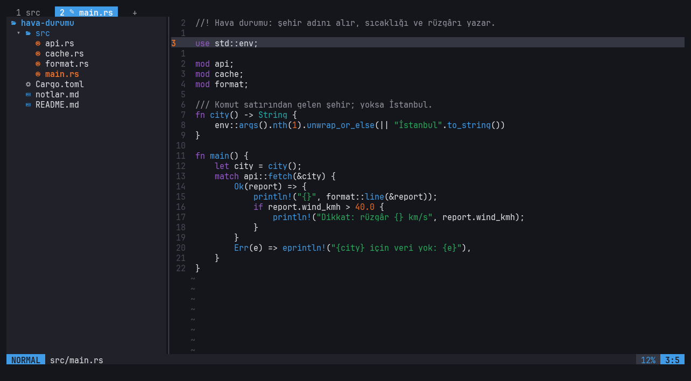
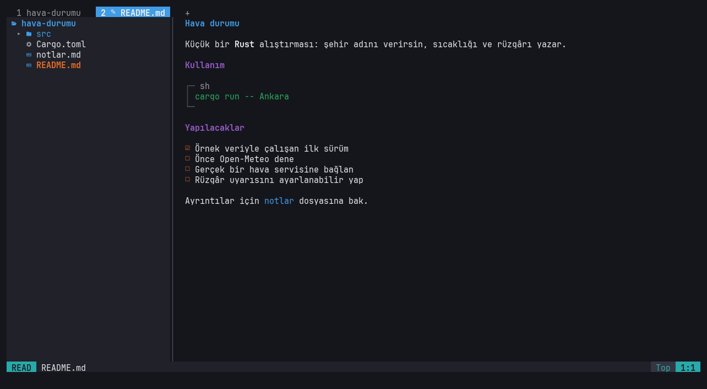

# fener

A terminal file manager whose text files open in LazyVim-style editor tabs. Rust + Ratatui.

The first tab is always the file manager: a fork of [liman](https://github.com/WertC-14/liman), which stays a
plain file manager of its own. Press Enter on a code, config or text file and it opens in a tab of its own, with the
project's folder tree beside it. `Alt+1` is always back to the files.

**Status:** early development.





## Code tabs

You do not need to know the keys: `Space` shows what can follow (which-key), and `Space s k` lists every key and
runs the one you pick. Space works like a super key; the everyday commands are one key after it. The menu
follows the file: code files get run / build, Markdown files get the reader and their headings.

| | | | |
|---|---|---|---|
| `Space Enter` run (F5), code | `Space b` build / check, code | `Space t` terminal open / close | `Space w` save |
| `Space m` reader / source, Markdown | `Space h` go to heading, Markdown | | |
| `Space Space` find files | `Space /` find text | `Space o` find in file | `Space e` folder tree |
| `Space 1…9` go to tab (1: files) | `Space s k` all keys | `Space u m` Markdown reader | `Space q q` quit |

- Tabs: `Alt+1` the files, `Alt+2…9` the others, or click a tab; `:q` closes a code tab. Unsaved changes show a `●`
  on the tab and are never dropped silently: `:q`, a middle click and quitting fener show that tab with a warning
  (`:q!` drops them).
- `F5` saves, builds and runs the file in a terminal under the text: `cargo run` in a Cargo package (`--bin`,
  `--example` as fits), else the file's own tool (`rustc lab-1.rs && ./lab-1`, `python3`, `cc`, `go run`, `node`,
  `bash`, ...)
- Terminal under the text: `Space t`, `Ctrl+/` or `F4` (as LazyVim); `Tab` on an empty command line goes back up
  to the text (with something typed it completes), `F6` too; `Ctrl+/` in the shell hides it
- `Ctrl+F` finds in this file (`Space s b`); Enter jumps, `n` / `N` go on
- Line numbers stay put (absolute); `Space u L` for relative ones
- Folder tree on the left (`Space e` or `Ctrl+B`, `Tab` moves between tree and text): the git repository around the file (else its folder), the file revealed;
  `Ctrl+H` / `Ctrl+L` between tree and text, `Enter`/`l` open, `h` close, `Backspace` the folder above
- Pickers that narrow while you type: Find Files (`Space Space`), Recent Files (`Space f r`), Find Text / grep
  (`Space /`), Keymaps (`Space s k`)
- Vim's language: `[count] [operator [count]] (motion | text object)`
  - motions: `h j k l`, `w W b B e E`, `0 ^ $`, `gg G` (`5G`), `f t F T ; ,`, `{ }`, `%`, `n N`, `*`
  - operators: `d c y > <` (`dd cc yy >> <<`), text objects `iw aw iW aW i" a" i' i( a( i[ i{ i<` ...
  - `x X s S D C Y p P J r ~ u Ctrl+R .`, Insert (`i a I A o O`), Visual (`v V`)
- Search `/` `?` with smart case, `:w`, `:e FILE`, `Ctrl+S`
- Syntax colors (keywords, functions and macros, types, strings, numbers, comments) for C-like, `#`-comment and
  `--`-comment languages and Markdown, in the file manager's theme
- Markdown files open in a reader: headings, lists, task boxes, quotes, framed code, **bold**, *italic*, links,
  wrapped at words. `j k Ctrl+D Ctrl+U g G` scroll, `i` or `Esc` edits the source there, `Space u m` back

The file manager itself is liman's: grid / normal / detailed views, Places, preview, built-in terminal, git panel,
tabs, themes. Its guide: [liman's KILAVUZ](https://github.com/WertC-14/liman/blob/main/docs/KILAVUZ.md).
Settings are shared with liman (`~/.config/liman/config`).

## Settings

`~/.config/fener/config.toml` (all optional; a mistake is reported in the first code tab and ignored):

```toml
[editor]
line-numbers = "absolute"   # absolute | relative | off
indent = 4                  # spaces per indent level (Tab, >>)
tree-open = true            # the folder tree beside a newly opened file

[run]                       # what F5 runs, by file extension: {file} {stem} {dir}
rs = "rustc {file} && ./{stem}"
py = "python3 -i {file}"

[keys]                      # key = command; they show up first in Keymaps (Space s k)
F9 = "run"
ctrl-t = "terminal"
```

Commands: `run`, `terminal`, `explorer`, `find-files`, `find-in-file`, `find-text`, `recent-files`, `keymaps`,
`themes`, `save`, `quit`, `toggle-reader`, `toggle-numbers`, `toggle-relative-numbers`, `clear-search`, `new-file`.

## Not yet (on purpose)

LSP, tree-sitter, plugins, split windows, a config file for the editor, Obsidian vault.
Find Files does not read `.gitignore` yet (hidden folders, `target`, `node_modules` are skipped).

## Build

```bash
cargo install --path crates/fener
fener                # the current folder
fener src/main.rs    # its folder, and the file in a code tab
```

## Layout

- `crates/fener-core` — the editor without terminal code: document (rope + change record + undo), Vim motions and
  text objects, modes, the command table, pickers, fuzzy matching, file walk and grep, the folder tree.
- `crates/fener-widgets` — Ratatui drawing of an editor; the theme is passed in.
- `crates/liman-core`, `crates/liman-widgets` — forked from liman.
- `crates/fener` — the app: liman's file manager plus code tabs (`src/app/code_tabs.rs`).

## License

MIT. The file manager parts come from liman (MIT, same author).
