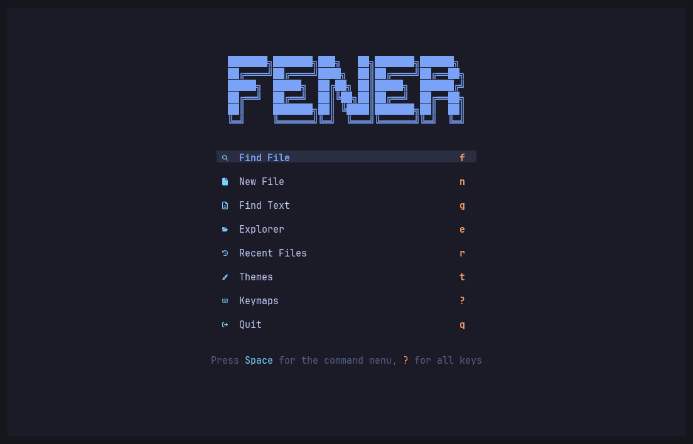
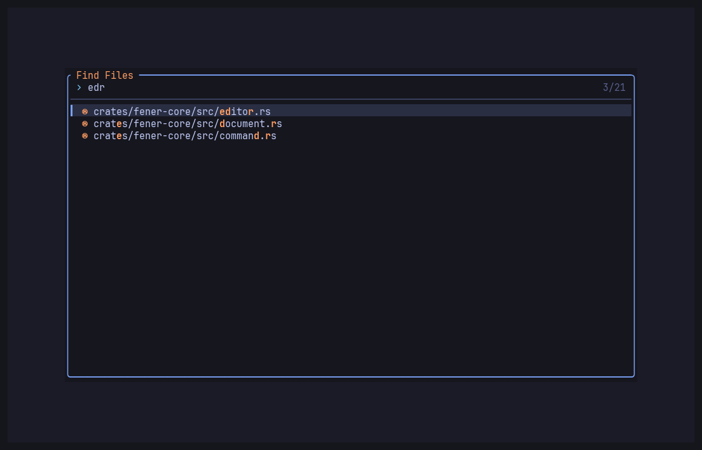
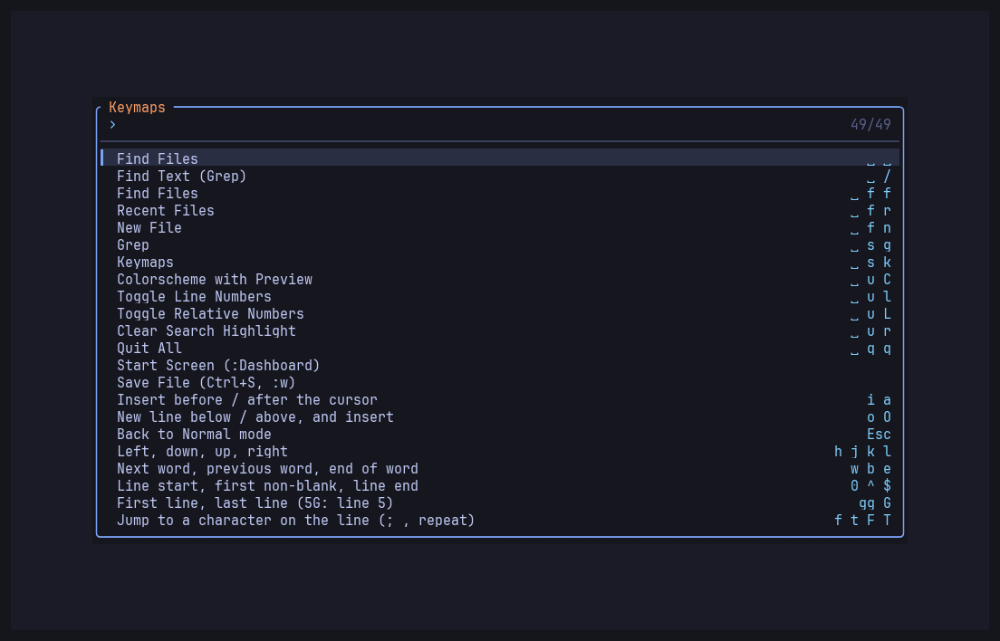
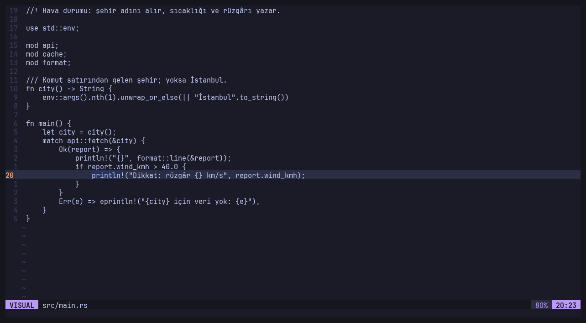
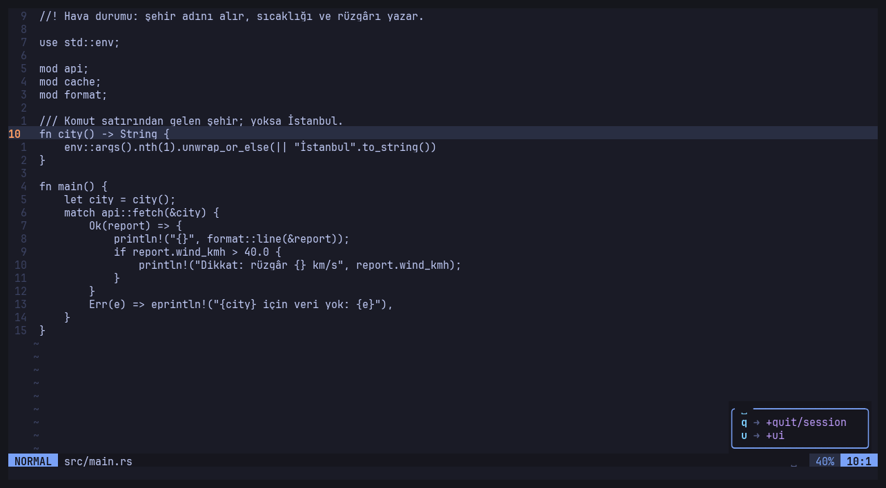

# fener

A modal terminal editor in the spirit of LazyVim, built with Rust and Ratatui.
It starts small and grows one piece at a time; sister project of [liman](https://github.com/WertC-14/liman).

**Status:** early development (v0.1 in progress).

You do not need to know the keys to start: `fener` alone opens a start screen with a menu,
`Space` shows what can follow (which-key), and `Space s k` (or `?` on the start screen) lists
every key and runs the one you pick.







## What works

- A start screen (LazyVim's dashboard): Find File `f`, New File `n`, Find Text `g`,
  Recent Files `r`, Themes `t`, Keymaps `?`, Quit `q`
- Pickers that narrow while you type (fuzzy, smart case): Find Files (`Space Space`, `Space f f`),
  Recent Files (`Space f r`), Find Text / grep (`Space /`, `Space s g`), Keymaps (`Space s k`),
  Colorschemes with live preview (`Space u C`): tokyonight night/storm/moon/day,
  catppuccin-mocha, gruvbox
- Open, edit and save a file: `fener FILE`, `:e FILE`, `:w`, `:q`, `:wq`, `:x`, `:q!`, `Ctrl+S`
- Vim's language: `[count] [operator [count]] (motion | text object)`
  - motions: `h j k l`, `w W b B e E`, `0 ^ $`, `gg G` (`5G`), `f t F T ; ,`, `{ }`, `%`, `n N`, `*`
  - operators: `d c y > <` (`dd cc yy >> <<`), text objects `iw aw iW aW i" a" i' i( a( i[ i{ i<` ...
  - `x X s S D C Y p P J r ~ u Ctrl+R .`, Insert (`i a I A o O`), Visual (`v V`)
- Search `/` `?` with smart case, highlighted matches, `:noh`
- `Space` leader with a which-key box (LazyVim's keys: `Space q q` quit, `Space u l` line numbers ...)
- Recent files and the theme are remembered in `~/.local/state/fener/`
- Nerd Font icons (as LazyVim); `FENER_ICONS=plain` turns them off
- LazyVim's look: tokyonight colors, relative line numbers, cursor line, a lualine-like status line

## Not yet (on purpose)

LSP, tree-sitter, plugins, file tree, multiple buffers and windows, a config file, Obsidian vault.
Find Files does not read `.gitignore` yet (hidden folders, `target`, `node_modules` are skipped).
They come one by one; see fm-research ADR 0010.

## Build

```bash
cargo install --path crates/fener
fener notes.md
```

## Layout

- `crates/fener-core` — no terminal code: the document (rope + change record + undo), Vim motions and text
  objects, the editor state machine, the command table, pickers, fuzzy matching, file walk and grep.
- `crates/fener` — the terminal app (Ratatui).

## License

MIT.
